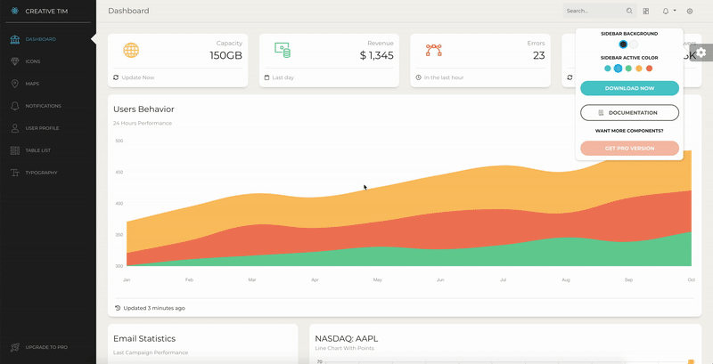

# Paper Dashboard React



If you are a react developer or a react website owner that needs to work within a dashboard and want to have a pretty sight while doing so, Paper Dashboard React is for you. Paper Dashboard React is a Bootstrap Admin Panel which combines soft colours with beautiful typography and spacious cards and graphics. It is a powerful tool, but it is light and easy to use. It has enough features to allow you to get the job done, but it is not crowded to the point where you can't find the files for a specific plugin.

We like consistency and design that blends into its purpose. Paper Dashboard React is a perfect example of our most thoughtful work. It combines over a dozen components and plugins, while looking like everything fits together. For an easy start or inspiration for you project, we have also create a set of example pages, like the user settings or usage graphics.

Paper Dashboard React is built using the same design language as Paper Dashboard 2.

**Bootstrap 4 Support** Paper Dashboard React is built on top of the much awaited Bootstrap 4 and uses the most used react framework that implements the Bootstrap 4 components on react, reactstrap. This makes starting a new project very simple. It also provides benefits if you are already working on a Bootstrap 4 and/or reactstrap project; you can just import the Paper Dashboard React style over it. Most of the elements have been redesigned; but if you are using an element we have not touched, it will fall back to the Bootstrap default.

**Example Pages** We wanted to fully display the power of this dashboard, so the kit comes packed with examples showing you how to use the components.

## Quick start

Quick start options:

- Clone the repo: `git clone https://github.com/firstskytouch/react-dashboard.git`.
- `npm i paper-dashboard-react`


## Documentation
The documentation for the Paper Dashboard React is hosted at our website.


## File Structure

Within the download you'll find the following directories and files:

```
├── CHANGELOG.md
├── ISSUE_TEMPLATE.md
├── LICENSE.md
├── README.md
├── docs
│   └── documentation.html
├── jsconfig.json
├── package.json
├── public
│   ├── favicon.ico
│   ├── index.html
│   └── manifest.json
└── src
    ├── index.js
    ├── logo-white.svg
    ├── logo.svg
    ├── routes.js
    ├── components
    │   ├── FixedPlugin
    │   │   └── FixedPlugin.jsx
    │   ├── Footer
    │   │   └── Footer.jsx
    │   ├── Navbars
    │   │   └── DemoNavbar.jsx
    │   └── Sidebar
    │       └── Sidebar.jsx
    ├── layouts
    │   └── Admin.jsx
    ├── variables
    │   ├── charts.jsx
    │   ├── general.jsx
    │   └── icons.jsx
    ├── views
    │   ├── Dashboard.jsx
    │   ├── Icons.jsx
    │   ├── Map.jsx
    │   ├── Notifications.jsx
    │   ├── Tables.jsx
    │   ├── Typography.jsx
    │   ├── Upgrade.jsx
    │   └── User.jsx
    └── assets
        ├── css
        │   ├── paper-dashboard.css
        │   ├── paper-dashboard.css.map
        │   └── paper-dashboard.min.css
        ├── demo
        ├── fonts
        ├── github
        ├── img
        │   └── faces
        └── scss
            ├── paper-dashboard
            │   ├── cards
            │   ├── mixins
            │   ├── plugins
            │   └── react
            │       ├── custom
            │       └── react-differences.scss
            └── paper-dashboard.scss
```
